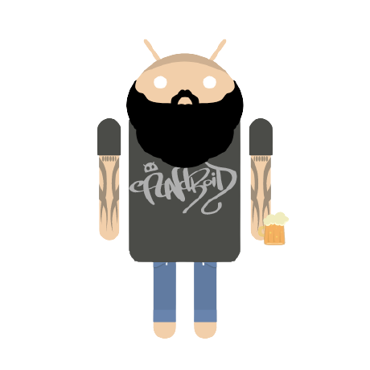

### Hi, I am Georgios 👋

I am an Android Engineer, karateka, beer crafter.

<!-- 🔭 I’m currently working at [@withplum](https://withplum.com/) -->
- 🌱 I’m currently learning Compose
- 📫 How to reach me: Twitter [@MeTaXaS4](https://twitter.com/MeTaXaS4)
- 📰 Articles
  - [Translating mobile apps, automate all the things!](https://medium.com/plum-engineering/translating-mobile-apps-automate-all-the-things-b76bb539b3)

## Stats

## Trophy showcase!

<!--
**GMetaxakis/gmetaxakis** is a ✨ _special_ ✨ repository because its `README.md` (this file) appears on your GitHub profile.

Here are some ideas to get you started:

- 🔭 I’m currently working on ...
- 🌱 I’m currently learning ...
- 👯 I’m looking to collaborate on ...
- 🤔 I’m looking for help with ...
- 💬 Ask me about ...
- 📫 How to reach me: ...
- 😄 Pronouns: ...
- ⚡ Fun fact: ...
-->
